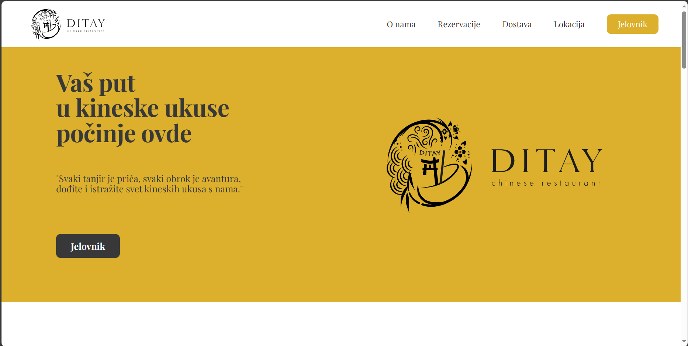

# Ditay Novi Sad

## Welcome! 👋

Thanks for checking out.

## Ditay Novi Sad , Chinese restaurant

Welcome to the Ditay Chinese Restaurant ! This project showcases a dynamic and visually appealing website designed for a Chinese restaurant. It has been developed using a combination of HTML, CSS, SCSS (Sass), and JavaScript to deliver an engaging and interactive user experience.

Key Features:

Responsive Design: The landing page is fully responsive, ensuring a seamless user experience across various devices, including desktops, tablets, and mobile phones.

Stunning Visuals: The use of CSS and SCSS enhances the aesthetics of the page, incorporating elegant color schemes, custom fonts, and attractive images that reflect the essence of Chinese cuisine.

Interactive Elements: JavaScript has been utilized to implement interactive features such as a navigation menu, image sliders, and a reservation form that allows users to make reservations directly through the website.

Menu Showcase: The landing page prominently displays the restaurant's menu, making it easy for visitors to explore the delicious dishes offered.

Contact Information: Users can easily find contact information, including the restaurant's address and phone number, to plan their visit or get in touch.

We welcome contributions from the community to improve and expand this landing page. If you have any ideas or suggestions, please don't hesitate to submit pull requests or open issues.

Thank you for visiting our Chinese Restaurant Landing Page repository, and we hope you find it both inspiring and informative!
